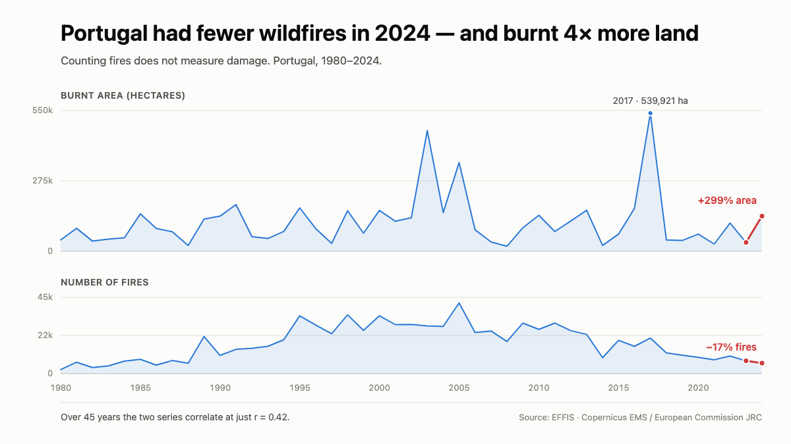

# Wildfire Metrics Lab

[🇧🇷 Português](README.pt-BR.md) · **🇬🇧 English**

"Wildfires up 250%" is a headline you have probably seen this summer. It is
almost always a count of **fires**, and a count of fires does not measure how
much land burnt. Those are two different numbers, and over 45 years of official
European data they barely move together.

This repo proves that against the source, in about 100 lines of standard-library
Python. No pandas, no openpyxl, no API key — an `.xlsx` is a zip of XML, so
`zipfile` and `ElementTree` are enough.


The inset is not decoration: it is the Pedrógão Grande fire at 02:48 on 19 June
2017, photographed from orbit because it was burning brightly enough to see at
night. That fire is the 2017 peak in the chart. The image and the data point are
the same event.

## The finding

Correlation between *number of fires* and *area burnt*, 1980–2024:

| Country | r | What it means |
|---|---|---|
| Spain | **0.18** | none — the count tells you essentially nothing |
| Greece | 0.41 | weak |
| Portugal | 0.42 | weak |
| France | 0.65 | moderate |
| Italy | 0.75 | moderate |

Portugal has the cleanest single example. From 2023 to 2024 the number of fires
fell **17%** while the area burnt rose **299%** — 34,510 → 137,651 hectares.
Fewer fires, four times the land. It is not a one-off: the same inversion shows
up in Portugal in 2010, 2012, 2013, 2016 and 2020.

## Why this is a data engineering repo

Because nothing in the stack catches this. The pipeline, the warehouse, the
dashboard and the model all faithfully compute whatever you asked for. The query
is correct. The number is correct. The conclusion is wrong — and the only place
that could have been caught was the moment someone chose which column to count.

The same trap, in less dramatic clothes: counting orders instead of revenue,
counting errors instead of affected users, counting jobs instead of
compute-hours. **The metric definition is the analysis.** Everything downstream
is arithmetic.

## What's here

| File | What it does |
|---|---|
| [`fetch_effis.py`](fetch_effis.py) | Downloads the official EFFIS workbook and parses both sheets to CSV. Stdlib only. |
| [`analyze.py`](analyze.py) | Correlations per country, plus every year where the two metrics moved in opposite directions. |
| [`make_chart.py`](make_chart.py) | Renders the analytical chart to HTML and exports PNGs via headless Chrome. |
| [`make_social_card.py`](make_social_card.py) | Renders the editorial card above. `both` / `inset` / `ground`. |
| [`chart.html`](chart.html) | Interactive version — hover, light/dark, and a table view with all 45 years. |
| [`sample_output/analysis.txt`](sample_output/analysis.txt) | Output of a real run, so you can read the results without running anything. |
| [`data/`](data/) | The two parsed CSVs. |

## Run it

```bash
python3 fetch_effis.py && python3 analyze.py && python3 make_chart.py
```

Python 3.9+. No dependencies. Chrome or Chromium is optional — it is only used
to export the PNGs, and the HTML chart is written either way.

## About the charts

There are two, and they do different jobs.

The **analytical chart** — [`chart.html`](chart.html), and the PNGs below — is the
one to read. Burnt area and fire count are quantities of different scale, so they
get two stacked panels on a shared x-axis rather than a dual-axis plot. That is
deliberate: two y-scales on one plot invent a correlation the data does not have,
which is exactly the error this repo is about.

<picture>
  <source media="(prefers-color-scheme: dark)" srcset="chart-dark.png">
  
</picture>

The **editorial card** at the top of this README makes one argument instead of
showing two series evenly: burnt area is drawn in ember, and the fire count is
demoted to a small grey sparkline. That is the point rendered as a design choice —
the metric everyone quotes is the one with no colour in it.

Run `python3 make_social_card.py both` for that version, `inset` for a procedural
ground with the satellite inset only, or `ground` for the satellite image
full-bleed. Note the ember duotone is applied at render time by an SVG filter; the
VIIRS day-night band is monochrome radiance, and the colour carries no measurement
meaning. See [`NOTICE`](NOTICE).

## The data

Source: **[EFFIS](https://forest-fire.emergency.copernicus.eu/)** — the European
Forest Fire Information System, part of the Copernicus Emergency Management
Service, operated by the European Commission's Joint Research Centre. The file
is their annual statistics workbook (`report_2024.xlsx`), covering 1980–2024
across 31 countries in two sheets: hectares burnt, and number of fires.

Licensed **CC BY 4.0**. See [`NOTICE`](NOTICE) for the attribution and the
changes made to the source data.

Two limits worth knowing before you quote any of this:

- EFFIS burnt-area mapping **only detects fires of roughly 30 hectares or
  larger**. "Area burnt" here means area from large fires, not everything that
  burnt.
- The published workbook **ends at 2024**. For the current season you need the
  EFFIS statistics portal or [NASA FIRMS](https://firms.modaps.eosdis.nasa.gov/),
  which serves near-real-time satellite hotspots and needs a free key.

## Licence

Code: [MIT](LICENSE). Data: CC BY 4.0, © European Union. Satellite imagery: NASA
Earth Observatory, free to reuse with attribution — *NASA Earth Observatory image
by Jesse Allen, using VIIRS day-night band data from the Suomi National
Polar-orbiting Partnership.* Full attribution and the list of changes made to
both sources are in [`NOTICE`](NOTICE).
